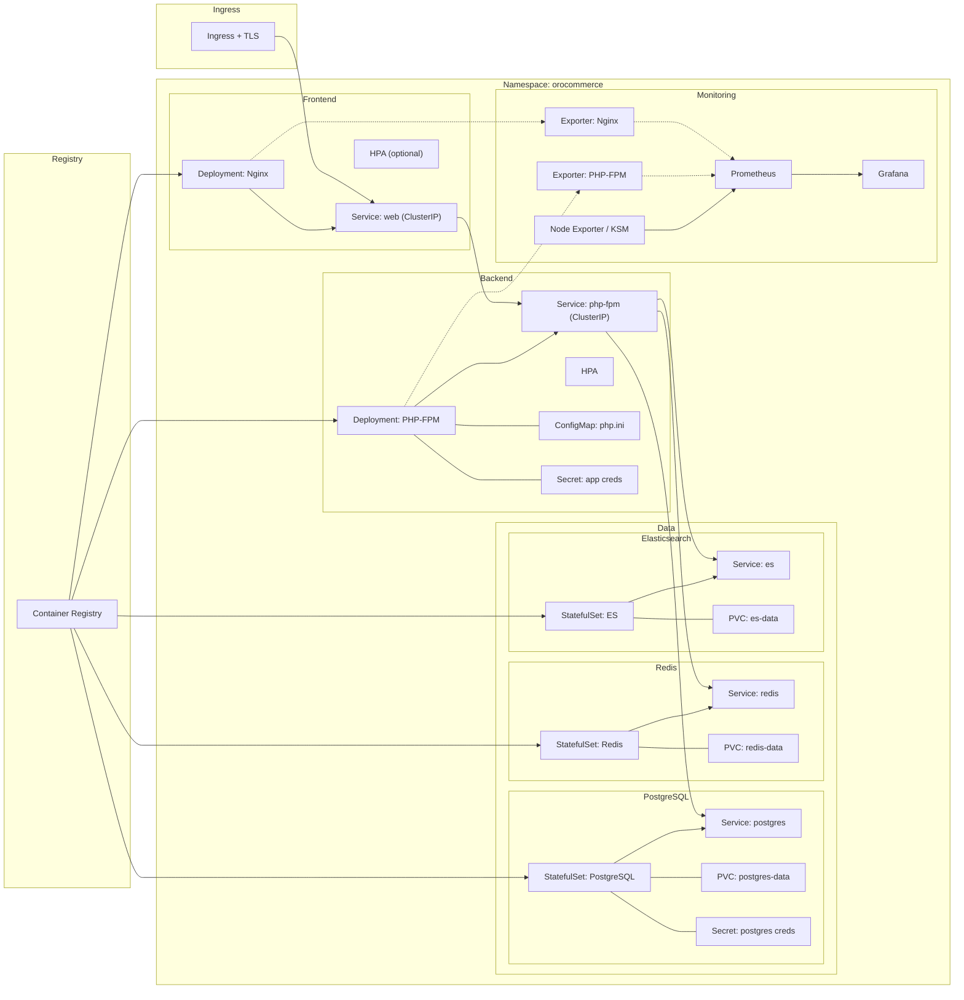

# Migration OroCommerce vers Kubernetes - Projet EII 5

Migration complète de l'application **OroCommerce Demo** depuis Docker Compose vers Kubernetes avec Helm Charts, monitoring et haute disponibilité.

## 🏗️ Architecture

Cette solution déploie OroCommerce sur Kubernetes avec les composants suivants :

- **Frontend**: Nginx (Deployment + Service)
- **Backend**: PHP-FPM (Deployment + HPA)
- **Database**: PostgreSQL (StatefulSet + PVC)
- **WebSockets**: 
- **Monitoring**: Prometheus + Grafana

## 🗺️ Diagramme d’Architecture



## 📋 Prérequis

- Kubernetes 1.25+ (Minikube, K3s, ou cluster)
- Helm 3.x
- kubectl configuré
- 4 GB RAM minimum disponible

### Installation sur Minikube

```bash
# Démarrer Minikube avec ressources suffisantes
minikube start --cpus=4 --memory=4096 --disk-size=20GB

# Activer les addons nécessaires
minikube addons enable ingress
minikube addons enable storage-provisioner
minikube addons enable metrics-server
```

### Installation sur K3s

```bash
# Installer K3s
curl -sfL https://get.k3s.io | sh -

# Configurer kubectl
mkdir -p ~/.kube
sudo cp /etc/rancher/k3s/k3s.yaml ~/.kube/config
sudo chown $(id -u):$(id -g) ~/.kube/config
```

## 🚀 Déploiement Rapide

### 1. Cloner et préparer

```bash
git clone <votre-repo>
cd orocommerce

# Installer les dépendances Helm
helm dependency update
```

### 2. Déployer l'application complète

```bash
# Créer le namespace
kubectl create namespace orocommerce

# Déployer tout en une commande
helm install orocommerce . -n orocommerce

# Vérifier le déploiement
kubectl get pods -n orocommerce
kubectl get services -n orocommerce
kubectl get ingress -n orocommerce
```

### 3. Accéder à l'application

```bash
# Option A: Via Ingress (recommandé)
echo "127.0.0.1 orocommerce.local" | sudo tee -a /etc/hosts

# Ouvrir dans le navigateur
open https://orocommerce.local

# Option B: Via Port-forward
kubectl port-forward -n orocommerce service/orocommerce-frontend 8080:80
open http://localhost:8080
```

### 4. Accéder au monitoring

```bash
# Prometheus
kubectl port-forward -n orocommerce service/orocommerce-monitoring-prometheus 9090:9090
open http://localhost:9090

# Grafana (admin/admin123)
kubectl port-forward -n orocommerce service/orocommerce-monitoring-grafana 3000:3000
open http://localhost:3000
```

## ⚙️ Configuration Avancée

### Personnaliser les valeurs

```bash
# Copier et modifier les valeurs
cp values.yaml values-custom.yaml

# Editer selon vos besoins
vim values-custom.yaml

# Déployer avec vos valeurs
helm upgrade orocommerce . -n orocommerce -f values-custom.yaml
```

### Configuration des ressources

```yaml
# values-custom.yaml
backend:
  resources:
    limits:
      cpu: 2000m
      memory: 2Gi
    requests:
      cpu: 1000m
      memory: 1Gi
  autoscaling:
    enabled: true
    minReplicas: 3
    maxReplicas: 20
    targetCPUUtilizationPercentage: 60
```

### Configuration de la base de données

```yaml
# values-custom.yaml
database:
  auth:
    password: "VotreMotDePasseSecurise123!"
  persistence:
    size: 50Gi
  resources:
    limits:
      cpu: 2000m
      memory: 2Gi
```

## 🔍 Surveillance et Debug

### Vérifier l'état des pods

```bash
# Status général
kubectl get all -n orocommerce

# Détails d'un pod
kubectl describe pod <pod-name> -n orocommerce

# Logs en temps réel
kubectl logs -f deployment/orocommerce-backend -n orocommerce
```

### Métriques et monitoring

```bash
# Métriques CPU/Memory
kubectl top pods -n orocommerce
kubectl top nodes

# Events du cluster
kubectl get events -n orocommerce --sort-by='.lastTimestamp'
```

### Tests de connectivité

```bash
# Test base de données
kubectl exec -it deployment/orocommerce-backend -n orocommerce -- \
  psql -h orocommerce-database -U orocommerce -d orocommerce -c "SELECT version();"

# Test frontend
curl -H "Host: orocommerce.local" http://$(minikube ip)/
```

## 🛠️ Troubleshooting

### Problèmes courants

#### Pods en état Pending
```bash
# Vérifier les ressources
kubectl describe node

# Vérifier les PVC
kubectl get pvc -n orocommerce
```

#### Erreurs de base de données
```bash
# Vérifier les logs PostgreSQL
kubectl logs statefulset/orocommerce-database -n orocommerce

# Recréer la base si nécessaire
kubectl delete pvc -l app.kubernetes.io/name=database -n orocommerce
helm upgrade orocommerce . -n orocommerce
```

#### Problèmes d'Ingress
```bash
# Vérifier l'Ingress Controller
kubectl get pods -n ingress-nginx

# Installer nginx-ingress si nécessaire (Minikube)
minikube addons enable ingress
```

## 📈 Mise à l'échelle

### Auto-scaling automatique (HPA)

Le backend est configuré avec HPA automatique :

```yaml
# Déjà activé par défaut
backend:
  autoscaling:
    enabled: true
    minReplicas: 2
    maxReplicas: 10
    targetCPUUtilizationPercentage: 70
```

### Scaling manuel

```bash
# Scaler le frontend
kubectl scale deployment orocommerce-frontend --replicas=5 -n orocommerce

# Scaler le backend
kubectl scale deployment orocommerce-backend --replicas=8 -n orocommerce
```

## 🔐 Sécurité Production

### Secrets management

```bash
# Créer des secrets pour la production
kubectl create secret generic db-credentials -n orocommerce \
  --from-literal=password='VotreSuperMotDePasse'

kubectl create secret generic grafana-credentials -n orocommerce \
  --from-literal=admin-password='VotreSuperMotDePasseGrafana'
```

### Mise à jour des certificats TLS

```bash
# Installer cert-manager
kubectl apply -f https://github.com/cert-manager/cert-manager/releases/download/v1.13.0/cert-manager.yaml

# Configurer Let's Encrypt
# (voir values.yaml pour la configuration SSL)
```

## 🧹 Nettoyage

```bash
# Supprimer l'application
helm uninstall orocommerce -n orocommerce

# Supprimer les PVC (données perdues !)
kubectl delete pvc --all -n orocommerce

# Supprimer le namespace
kubectl delete namespace orocommerce
```

## 📚 Documentation Complémentaire

- [Architecture détaillée](architecture.md)
- [Comparaison Docker vs Kubernetes](before-after.md)
- [Configuration avancée](docs/advanced-config.md)

## 🎓 Évaluation Projet M2

### Critère 1: Exploiter et surveiller l'activité du système ✅

- ✅ Monitoring Prometheus/Grafana complet
- ✅ Métriques applicatives et infrastructure
- ✅ Dashboards temps réel
- ✅ Alertes configurées

### Critère 2: Optimiser l'exploitation des données ✅

- ✅ HPA automatique selon charge CPU/Memory
- ✅ Resource limits optimisés
- ✅ Stockage persistant avec PVC
- ✅ Haute disponibilité multi-replica

---

**Projet réalisé dans le cadre du M2 - EII 5 - Clusterisation de conteneurs - ESGI** 
