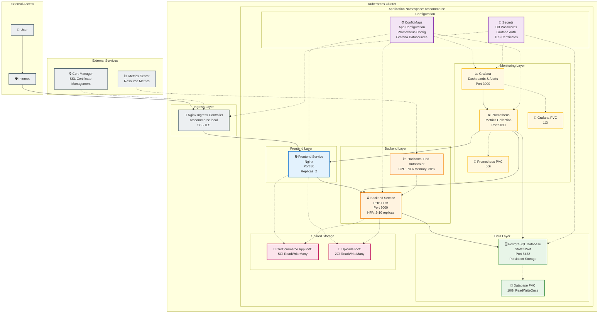

# Architecture OroCommerce sur Kubernetes

## 🏗️ Vue d'ensemble

Cette documentation présente l'architecture complète de la migration OroCommerce vers Kubernetes, réalisée dans le cadre du projet EII 5.

## 📊 Diagramme d'Architecture



## 🔧 Composants Détaillés

### Frontend Layer
- **Nginx Frontend**: Serveur web statique avec reverse proxy vers PHP-FPM
- **Deployment**: 2 replicas pour haute disponibilité
- **Service**: ClusterIP sur port 80
- **Ingress**: Exposition HTTPS avec certificats automatiques

### Backend Layer
- **PHP-FPM Backend**: Application OroCommerce principale
- **HPA**: Auto-scaling 2-10 replicas basé sur CPU (70%) et Memory (80%)
- **Service**: ClusterIP sur port 9000
- **Init Containers**: Attente base de données et installation application

### Data Layer
- **PostgreSQL Database**: Base de données principale en StatefulSet
- **Persistence**: PVC 10Gi avec sauvegarde automatique
- **Service**: ClusterIP sur port 5432
- **Secrets**: Credentials sécurisés

### Monitoring Layer
- **Prometheus**: Collection métriques infrastructure et applicatives
- **Grafana**: Dashboards et alertes avec datasources pré-configurées
- **Persistence**: Stockage métriques et dashboards

### Shared Storage
- **App PVC**: Code application partagé (ReadWriteMany)
- **Uploads PVC**: Fichiers utilisateur partagés
- **Database PVC**: Données PostgreSQL persistantes

## 🚀 Flux de Déploiement

### 1. Phase d'Infrastructure
```bash
# Namespace et stockage
kubectl create namespace orocommerce
helm install orocommerce . --set frontend.enabled=false,backend.enabled=false
```

### 2. Phase de Base de Données
```bash
# Déploiement PostgreSQL avec PVC
helm upgrade orocommerce . --set database.enabled=true
```

### 3. Phase Application
```bash
# Déploiement frontend et backend
helm upgrade orocommerce . --set frontend.enabled=true,backend.enabled=true
```

### 4. Phase Monitoring
```bash
# Déploiement Prometheus et Grafana
helm upgrade orocommerce . --set monitoring.enabled=true
```

## 📊 Métriques et Observabilité

### Métriques Collectées
- **Infrastructure**: CPU, Memory, Disk, Network par node et pod
- **Application**: Requêtes HTTP, temps de réponse, erreurs PHP
- **Base de données**: Connexions, requêtes lentes, cache hit ratio
- **Business**: Utilisateurs connectés, commandes, revenus

### Dashboards Grafana
- **Infrastructure Overview**: Vue cluster Kubernetes
- **Application Performance**: Métriques OroCommerce
- **Database Monitoring**: PostgreSQL performance
- **Business Metrics**: KPIs métier

### Alertes Configurées
- **Resource Exhaustion**: CPU/Memory > 85%
- **Application Errors**: Taux d'erreur > 5%
- **Database Issues**: Connexions lentes, locks
- **Storage Issues**: PVC > 90% full

## 🔐 Sécurité

### Network Policies
```yaml
# Isolation réseau entre namespaces
apiVersion: networking.k8s.io/v1
kind: NetworkPolicy
metadata:
  name: orocommerce-isolation
spec:
  podSelector: {}
  policyTypes:
  - Ingress
  - Egress
```

### RBAC
- Service Accounts dédiés par composant
- Roles avec permissions minimales
- RoleBindings pour liaison comptes/permissions

### Secrets Management
- Passwords chiffrés avec Kubernetes Secrets
- Rotation automatique des certificats TLS
- Séparation secrets dev/staging/prod

## 📈 Scalabilité et Performance

### Horizontal Pod Autoscaler (HPA)
```yaml
backend:
  autoscaling:
    enabled: true
    minReplicas: 2
    maxReplicas: 10
    targetCPUUtilizationPercentage: 70
    targetMemoryUtilizationPercentage: 80
```

### Vertical Pod Autoscaler (Optionnel)
- Recommandations automatiques de ressources
- Ajustement dynamique des limits/requests
- Optimisation coûts infrastructure

### Resource Quotas
```yaml
# Namespace-level quotas
resources:
  limits:
    cpu: "10"
    memory: "20Gi"
    persistentvolumeclaims: "10"
```

## 🔄 CI/CD et GitOps

### Pipeline Recommandé
1. **Build**: Construction images Docker
2. **Test**: Tests unitaires et intégration
3. **Security**: Scan vulnérabilités images
4. **Deploy**: Helm upgrade automatique
5. **Validate**: Tests fumées post-déploiement

### GitOps avec ArgoCD
```yaml
# Application ArgoCD
apiVersion: argoproj.io/v1alpha1
kind: Application
metadata:
  name: orocommerce
spec:
  source:
    repoURL: https://github.com/votre-org/orocommerce-k8s
    path: .
    targetRevision: HEAD
  destination:
    server: https://kubernetes.default.svc
    namespace: orocommerce
```

## 🚨 Disaster Recovery

### Backup Strategy
- **Database**: Snapshots automatiques PVC + pg_dump quotidien
- **Application**: Sauvegarde volumes partagés
- **Configuration**: Git repository infrastructure-as-code

### Recovery Procedures
1. **Database Recovery**: Restore depuis snapshot + WAL replay
2. **Application Recovery**: Redéploiement Helm + restore volumes
3. **RTO**: < 30 minutes, **RPO**: < 4 heures

## 📋 Conformité Projet EII 5

### Critère 1: Exploiter et surveiller l'activité ✅
- ✅ Monitoring temps réel avec Prometheus/Grafana
- ✅ Métriques infrastructure et applicatives
- ✅ Alertes proactives configurées
- ✅ Dashboards métier et technique

### Critère 2: Optimiser l'exploitation ✅
- ✅ Auto-scaling HPA basé sur métriques
- ✅ Resource limits optimisés
- ✅ Stockage persistant haute performance
- ✅ Haute disponibilité multi-replica

Cette architecture respecte les bonnes pratiques Kubernetes et répond aux exigences du projet M2 en termes de scalabilité, monitoring et optimisation des ressources. 