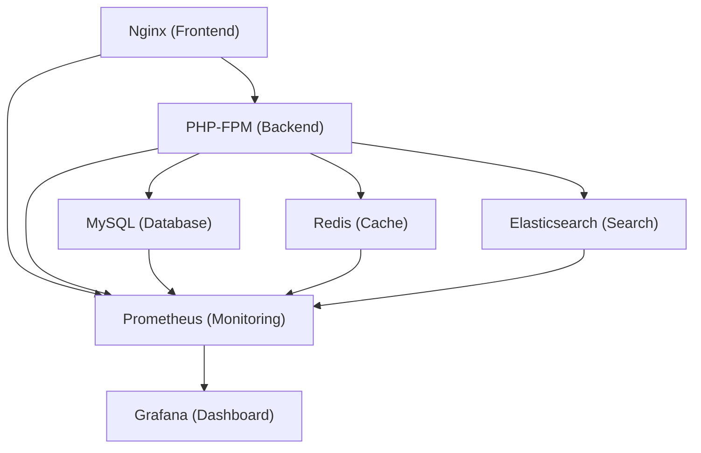

# OroCommerce Kubernetes Migration

## Introduction

OroCommerce est une plateforme e-commerce B2B open source, conçue pour répondre aux besoins complexes des entreprises. Ce projet vise à migrer l’application **OroCommerce Demo** (https://github.com/oroinc/docker-demo) d’une architecture Docker Compose vers Kubernetes, afin de bénéficier de la scalabilité, de la haute disponibilité et de l’automatisation offertes par les technologies cloud-native.

La migration s’inscrit dans le cadre du Bloc RNCP EII 5 - Clusterisation de conteneurs, et met l’accent sur l’industrialisation, la supervision et l’optimisation de l’exploitation applicative.

---

## Sommaire

1. [Objectifs du projet](#objectifs-du-projet)
2. [Architecture cible](#architecture-cible)
3. [Composants migrés et choix techniques](#composants-migrés-et-choix-techniques)
4. [Helm et structure des charts](#helm-et-structure-des-charts)
5. [Guide d’installation détaillé](#guide-dinstallation-detaillé)
6. [Monitoring et supervision](#monitoring-et-supervision)
7. [Comparatif avant/après](#comparatif-avantaprès)
8. [Bonnes pratiques Kubernetes](#bonnes-pratiques-kubernetes)
9. [FAQ](#faq)
10. [Glossaire](#glossaire)
11. [Ressources complémentaires](#ressources-complémentaires)
12. [Contraintes techniques](#contraintes-techniques)
13. [Auteurs](#auteurs)

---

## Objectifs du projet

- Migrer tous les services OroCommerce (frontend, backend, base de données, cache, recherche) vers Kubernetes.
- Automatiser le déploiement avec Helm Charts.
- Mettre en place un monitoring complet (Prometheus, Grafana).
- Optimiser l’utilisation des ressources et la répartition de charge.
- Sécuriser les accès (TLS, secrets).
- Documenter l’architecture et la procédure d’installation.
- Comparer les performances et la maintenabilité avant/après migration.

---

## Architecture cible



Chaque composant est isolé dans son propre pod ou StatefulSet, ce qui permet une gestion fine des ressources, de la scalabilité et de la tolérance aux pannes.

---

## Composants migrés et choix techniques

### 1. **Frontend : Nginx**
- **Rôle** : Sert les fichiers statiques et fait office de reverse proxy vers PHP-FPM.
- **Déploiement** : Deployment + Service ClusterIP.
- **Bonnes pratiques** : ConfigMap pour la configuration, readiness/liveness probes.

### 2. **Backend : PHP-FPM**
- **Rôle** : Exécute l’application OroCommerce.
- **Déploiement** : Deployment + HPA (Horizontal Pod Autoscaler).
- **Bonnes pratiques** : Resource limits, readiness/liveness probes, variables d’environnement via ConfigMap/Secret.

### 3. **Database : MySQL**
- **Rôle** : Stocke les données applicatives.
- **Déploiement** : StatefulSet + PersistentVolumeClaim.
- **Bonnes pratiques** : Utilisation de secrets pour les mots de passe, sauvegardes automatisées, anti-affinité pour la haute disponibilité.

### 4. **Cache : Redis**
- **Rôle** : Accélère l’application via le cache.
- **Déploiement** : StatefulSet.
- **Bonnes pratiques** : Persistence activée, resource limits, monitoring activé.

### 5. **Search : Elasticsearch**
- **Rôle** : Fournit la recherche avancée.
- **Déploiement** : StatefulSet.
- **Bonnes pratiques** : Resource limits, anti-affinité, monitoring.

### 6. **Monitoring : Prometheus & Grafana**
- **Rôle** : Supervision, alerting, visualisation des métriques.
- **Déploiement** : Helm charts officiels.
- **Bonnes pratiques** : Dashboards personnalisés, alertes sur la disponibilité et la saturation des ressources.

---

## Helm et structure des charts

Helm est utilisé pour automatiser et paramétrer le déploiement de chaque composant. Chaque service dispose de son propre chart, permettant une gestion modulaire et réutilisable.

**Exemple d’arborescence :**
```
charts/
  nginx/
  php/
  mysql/
  redis/
  elasticsearch/
  prometheus/
  grafana/
```

**Extrait de values.yaml pour MySQL :**
```yaml
mysql:
  image: mysql:8.0
  resources:
    requests:
      cpu: 500m
      memory: 1Gi
    limits:
      cpu: 1
      memory: 2Gi
  persistence:
    enabled: true
    size: 10Gi
  auth:
    rootPassword: "{{ .Values.mysqlRootPassword }}" # Stocké dans un Secret
```

**Gestion des secrets :**
```yaml
apiVersion: v1
kind: Secret
metadata:
  name: mysql-secret
stringData:
  mysql-root-password: "votreMotDePasseSecurise"
```

---

## Guide d’installation détaillé

### Prérequis

- Kubernetes 1.25+
- Helm 3.x
- Kubectl configuré
- Accès à un cluster (local ou cloud)
- (Optionnel) Ingress Controller pour l’accès externe

### Étapes détaillées

1. **Cloner ce dépôt**
   ```bash
   git clone <url-du-repo>
   cd <repo>
   ```

2. **Configurer les valeurs**
   - Modifier les fichiers `values.yaml` pour chaque chart selon vos besoins (ressources, mots de passe, etc.).
   - Créer les secrets nécessaires :
     ```bash
     kubectl create secret generic mysql-secret --from-literal=mysql-root-password=VOTRE_MDP
     ```

3. **Déployer les charts Helm**
   ```bash
   helm install nginx charts/nginx/
   helm install php charts/php/
   helm install mysql charts/mysql/
   helm install redis charts/redis/
   helm install elasticsearch charts/elasticsearch/
   helm install prometheus charts/prometheus/
   helm install grafana charts/grafana/
   ```

4. **Configurer l’accès externe**
   - Installer un Ingress Controller (ex : NGINX Ingress).
   - Déployer un Ingress pour exposer l’application en HTTPS (certificat TLS recommandé).

5. **Superviser l’application**
   - Accéder à Grafana via port-forward ou Ingress.
   - Importer les dashboards fournis dans le dossier `dashboards/`.

6. **Rollback et mise à jour**
   - Pour rollback :
     ```bash
     helm rollback <release> <revision>
     ```
   - Pour mettre à jour :
     ```bash
     helm upgrade <release> charts/<chart> -f charts/<chart>/values.yaml
     ```

---

## Monitoring et supervision

- **Prometheus** collecte les métriques de tous les pods et services (CPU, mémoire, disponibilité, etc.).
- **Grafana** permet de visualiser l’état du cluster, l’utilisation des ressources, la santé applicative.
- **Exemples de dashboards** :
  - Utilisation CPU/mémoire par pod
  - Latence des requêtes
  - Disponibilité des services
- **Alertes types** :
  - Pod en crashloop
  - Utilisation CPU > 80%
  - Espace disque faible sur MySQL

---

## Comparatif avant/après

| Critère                | Docker Compose         | Kubernetes + Helm         |
|------------------------|-----------------------|---------------------------|
| Scalabilité            | Limitée (manuelle)    | Automatique (HPA)         |
| Haute disponibilité    | Complexe              | Native (StatefulSet, HA)  |
| Monitoring             | Basique               | Avancé (Prometheus, Grafana) |
| Sécurité               | Basique               | Secrets, TLS, RBAC        |
| Déploiement            | Manuel                | Automatisé (Helm)         |
| Gestion des ressources | Limitée               | Fine (limits, requests)   |
| Rollback               | Difficile             | Simple (Helm rollback)    |

---

## Bonnes pratiques Kubernetes

- **Sécurité** : Toujours utiliser des secrets pour les mots de passe, activer TLS, limiter les droits RBAC.
- **Ressources** : Définir requests/limits pour chaque pod.
- **Labels/Annotations** : Utiliser des labels cohérents pour le monitoring, le déploiement et la traçabilité.
- **Probes** : Configurer readiness et liveness probes pour chaque service.
- **Persistence** : Utiliser des volumes persistants pour les bases de données et caches.
- **Logs** : Centraliser les logs (ex : Loki, EFK).

---

## FAQ

**Q : Comment restaurer une base MySQL ?**
R : Utilisez un job Kubernetes avec un volume monté contenant le dump SQL.

**Q : Comment accéder à l’application en local ?**
R : Utilisez `kubectl port-forward` ou configurez un Ingress avec un DNS local.

**Q : Comment ajouter un nouveau composant ?**
R : Créez un nouveau chart Helm et adaptez les valeurs dans le dossier `charts/`.

---

## Glossaire

- **Pod** : Unité de déploiement de base sur Kubernetes.
- **StatefulSet** : Contrôleur pour les applications nécessitant une identité stable et du stockage persistant.
- **Helm** : Gestionnaire de packages pour Kubernetes.
- **Ingress** : Objet Kubernetes pour gérer l’accès HTTP/HTTPS externe.
- **HPA** : Horizontal Pod Autoscaler, ajuste dynamiquement le nombre de pods.
- **PVC** : PersistentVolumeClaim, demande de stockage persistant.

---

## Ressources complémentaires

- [Documentation officielle OroCommerce](https://doc.oroinc.com/)
- [Helm Charts Best Practices](https://helm.sh/docs/chart_best_practices/)
- [Kubernetes Documentation](https://kubernetes.io/docs/)
- [Prometheus Operator](https://github.com/prometheus-operator/prometheus-operator)
- [Grafana Dashboards](https://grafana.com/grafana/dashboards)

---

## Contraintes techniques

- Kubernetes 1.25+
- Helm 3.x
- Secrets pour les mots de passe
- Limites de ressources définies
- SSL/TLS activé
- (Optionnel) Haute disponibilité

---

## Auteurs

- [Nom Prénom 1]
- [Nom Prénom 2]
- [Nom Prénom 3]
- [Nom Prénom 4] 